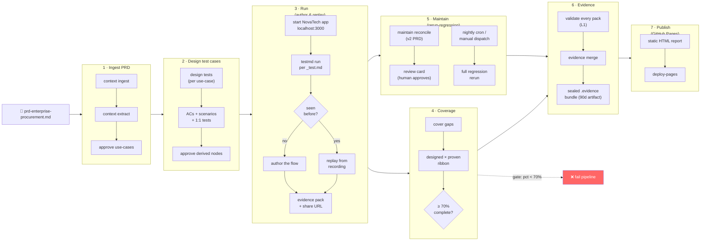

# NovaTech Hi-Tech Assurance Flow

A requirements-to-evidence assurance pipeline built with [`kane-cli`](https://www.npmjs.com/package/@testmuai/kane-cli), using a **Hi-Tech enterprise procurement (quote-to-order)** flow as the product under test. A PRD goes in one end. A sealed, auditable evidence pack comes out the other, with every acceptance criterion traced through a designed test to a proven (or failed) run.

- **Product under test:** NovaTech Business Store (`app/`), a B2B portal where corporate buyers configure laptops and workstations, build quotes with volume pricing and services, pay on account, and route high-value orders through approval.
- **Requirements:** [`docs/prd-enterprise-procurement.md`](docs/prd-enterprise-procurement.md) (v1) and [`docs/prd-enterprise-procurement-v2.md`](docs/prd-enterprise-procurement-v2.md) (the change used in the maintenance demo).
- **Step-by-step local runbook:** [`RUN-GUIDE.md`](RUN-GUIDE.md)

## What's in the repo

| Path | What it is |
|---|---|
| `docs/prd-enterprise-procurement.md` | Source requirements (v1): 8 functional requirements |
| `docs/prd-enterprise-procurement-v2.md` | Changed PRD: Device-as-a-Service, two-level approval, Net 45 |
| `app/` | NovaTech Business Store (Next.js 14). Implements **v1 only** |
| `.context/` | The assurance graph: sources, use-cases, ACs, scenarios, tests, and the review/commit history that produced them |
| `.testmuai/tests/*_test.md` | Designed, runnable tests (1:1 with committed test nodes in the graph) |
| `.testmuai/variables/novatech.json` | Test data for the `{{placeholders}}` in the tests (`{{start_url}}`, `{{laptop_product}}`, …) |
| `.testmuai/evidence/*.evidence` | Sealed evidence pack from a verified local run |
| `.github/workflows/assurance-pipeline.yml` | The 7-stage CI pipeline |
| `.github/actions/kane-setup/` | Composite action: installs kane-cli and Chrome, then authenticates |
| `.github/actions/start-app/` | Composite action: builds the app and serves it on `localhost:3000` inside the runner |
| `.github/scripts/` | Helper scripts the workflow calls (auto-approve, design loop, test runner, evidence merge, HTML report) |
| `RUN-GUIDE.md` | Manual, command-by-command runbook |

## Why this flow for Hi-Tech enterprise

It covers the requirement types enterprise hi-tech QA teams find hardest to keep traced:

| Requirement type | PRD section |
|---|---|
| Product compatibility rules | FR-2: 64 GB needs Core Ultra 9; 4 TB is Workstation only; disabled options show a reason |
| Tiered / contract pricing | FR-3: volume discounts of 5% / 10% / 15% at 10 / 50 / 100 units |
| Conditional per-device services | FR-4: Autopilot is Windows only; imaging needs 10+ devices |
| Supply constraints | FR-1/3/5: backorders, lead-time-driven delivery dates, End-of-Life products |
| Financial controls | FR-6: PO format, $150K credit limit, $10K card cap, 3-strike card lockout |
| Governance / segregation of duties | FR-7: $25K approval threshold, rejection reasons, no self-approval |
| Localization / compliance | FR-5: country postal formats, tax-exemption certificates |

## The flow



Stage 3 is where the "author once, replay forever" model pays off. The first run of a new test authors it live: an AI agent drives a real browser through the steps. Every later run replays the recorded steps deterministically, with no LLM cost and no flakiness from re-reasoning. That lasts until the test's wording or an earlier step changes, which invalidates the recording and re-authors from that point on.

## Verified local run

A real run on kane-cli 0.8.10 against `http://localhost:3000`:

| Stage | Command | Result | Time |
|---|---|---|---|
| Ingest | `context ingest docs/prd-enterprise-procurement.md --mode ci` | Source `prd-enterprise-procurement` landed | ~5 s |
| Extract | `context extract --mode ci` | **8 use-cases** extracted, each cited to the PRD | ~3 min |
| Approve | `.github/scripts/approve-derived.sh` | 8 use-cases → trusted | ~5 s |
| Design | `design tests --use-case uc-8 --mode ci --max 2` | 3 ACs, 2 scenarios, 2 tests | ~7 min |
| Run | `testmd run <laptop-configurator…_test.md> --agent --headless` | 🟢 **Passed**, 4/4 steps | ~4 min |
| Coverage | `cover gaps` | uc-8 designed 100% · proven 63% | instant |

Use-cases extracted from the PRD:

| ID | Use-case |
|---|---|
| uc-1 | Pay for an enterprise order |
| uc-2 | Approve or reject a high-value enterprise order |
| uc-3 | Submit an over-limit enterprise order for approval |
| uc-4 | Place an enterprise device order |
| uc-5 | Arrange shipping and delivery for an enterprise order |
| uc-6 | Build and save an enterprise procurement quote |
| uc-7 | Select per-device services and support |
| uc-8 | Configure a device for a quote |

The committed graph has tests designed for **uc-8** only. The first CI run designs the remaining use-cases automatically, because stage 2 walks every use-case the coverage ribbon flags as incomplete.

## Stage-by-stage

1. **Ingest PRD.** `kane-cli context ingest <prd> --mode ci` lands the source, and `context extract --mode ci` proposes use-cases from it. `approve-derived.sh` then auto-approves them, since nobody watches an interactive review chat in CI.
2. **Design test cases.** `design-pending-use-cases.sh` follows the `ready_command` hints from `kane-cli cover gaps`. It runs `kane-cli design tests --use-case <id> --mode ci` for every incomplete use-case (proposing ACs, scenarios and a 1:1 test per scenario), then approves the new nodes.
3. **Run (author and replay).** The `start-app` action builds and serves NovaTech on `localhost:3000` inside the runner. Then `kane-cli testmd run` executes every `*_test.md` with `.testmuai/variables/novatech.json`. Pass/fail, duration and a Test Manager share URL go to the job summary, and every evidence pack is staged for stage 6.
4. **Coverage.** `kane-cli cover gaps --mode ci --json` reports the dual-axis ribbon: the share of ACs with a live, passing test, and the share of use-cases fully designed. The job fails the pipeline if design completeness drops below 70%.
5. **Maintain (rerun-regression).** Runs on the nightly cron or a manual dispatch. It can reconcile the graph against an updated PRD with `maintain reconcile --plan`, which only *stages* a plan: nothing commits without human review. It then reruns the same test set from stage 3 as a regression pass.
6. **Evidence.** Every pack from stages 3 and 5 is validated at L1 (`kane-cli evidence validate`). Packs that fail are excluded and reported instead of aborting the merge. The valid packs are merged into one sealed bundle (`kane-cli evidence merge`), re-validated, and uploaded as a 90-day artifact, and a static HTML report is built.
7. **Publish (GitHub Pages).** The HTML report and merged `.evidence` pack are deployed to GitHub Pages.

## Running it in GitHub Actions

### 1. Secrets

**Settings → Secrets and variables → Actions:**

- `LT_USERNAME`
- `LT_ACCESS_KEY`

A manual run can override either one for that run only, via the `lt_username` / `lt_access_key` inputs. Both values are masked in the logs.

### 2. One-time setup: GitHub Pages

**Settings → Pages → Build and deployment → Source → GitHub Actions**

Each run that reaches stage 7 then publishes to `https://<owner>.github.io/<repo>/`.

### 3. Trigger

**Actions → KaneAI Assurance Pipeline → Run workflow**

| Input | Default when blank | Purpose |
|---|---|---|
| `prd_path` | `docs/prd-enterprise-procurement.md` | PRD to ingest |
| `max_tests` | no ceiling (kane-cli estimates) | Caps scenario+test pairs designed per use-case (`--max`) |
| `test_limit` | run every designed test | Caps how many tests stage 3 runs (first N, sorted). Stage 5 reruns **that exact set** |
| `project_id` | account default | Test Manager project ID (`kane-cli config project`) |
| `folder_id` | account default | Test Manager folder ID (`kane-cli config folder`) |
| `reconcile_prd` | skipped | Stage 5: reconcile against an updated PRD, e.g. `docs/prd-enterprise-procurement-v2.md` |
| `lt_username` / `lt_access_key` | repo secrets | Override credentials for this run only |

**Recommended first run:** `max_tests = 2`, `test_limit = 3`. Designing all 8 use-cases takes roughly 45–60 minutes, and each new test takes about 4 minutes to author on first run.

Triggers:
- **Push to `main`** touching `docs/**`, `app/**`, `.testmuai/tests/**`, or the workflow → stages 1–4, 6–7
- **Pull request** → stages 1–4, 6–7
- **Nightly cron** (`0 3 * * *`) → stage 5 (regression) → 6–7
- **Manual dispatch** → all stages, with the inputs above

### Re-running a single stage

Artifacts from a previous attempt aren't visible to a new attempt unless the job that created them is also re-run. If you re-run only stage 2, it can't find stage 1's upload. The workflow catches this and falls back to the `.context/` and `.testmuai/tests/` committed in the repo, with a `::warning::`. To pick up genuinely new output, re-run stage 1 too, or use **Re-run all jobs**.

## The maintenance demo (the closer)

The v2 PRD changes the approval and payment rules and adds a new offering:

| Change | Type |
|---|---|
| Approval chain: Procurement Manager, **then Finance Director above $100K** | MODIFY (FR-7) |
| PO terms: **Net 45** available for orders above $50K | MODIFY (FR-6) |
| **Device-as-a-Service**: 36-month subscription, 10-device minimum, PO only | ADD (FR-9) |

Locally:
```bash
kane-cli maintain reconcile --from docs/prd-enterprise-procurement-v2.md \
  --source-id prd-enterprise-procurement --mode ci --plan
kane-cli context list --stale
kane-cli cover gaps
```
In CI: run the pipeline with `reconcile_prd = docs/prd-enterprise-procurement-v2.md`.

The app implements v1 only, so the new and changed requirements show up as gaps or failing tests. That's the moment to show that the suite follows the requirements rather than someone's memory.

## Local usage

```bash
# 1. Start the app (terminal 1)
cd app && npm install && npm run build && npm start      # http://localhost:3000

# 2. Run the flow (terminal 2, repo root)
export KANE_CLI_USER_AGENT=my-laptop
kane-cli login --username <user> --access-key <key>

kane-cli context ingest docs/prd-enterprise-procurement.md --mode ci
kane-cli context extract --mode ci
bash .github/scripts/approve-derived.sh
kane-cli design tests --use-case uc-8 --mode ci --max 2
bash .github/scripts/approve-derived.sh
kane-cli testmd run .testmuai/tests/<file>_test.md --agent --variables-file .testmuai/variables/novatech.json
kane-cli cover gaps
```

The full runbook, with evidence merge, maintenance and troubleshooting, is in [`RUN-GUIDE.md`](RUN-GUIDE.md).

## App test hooks

| Hook | Effect |
|---|---|
| `?reset=1` | Clears the quote, persona and approval requests (tests start here) |
| `?seed=d1:30` | Sets the quote to exactly these lines (`productId:qty`, comma-separated) |
| `?role=approver` / `?role=buyer` | Marcus Lee (Procurement Manager) / Priya Shah (IT Buyer) |
| Card ending `0000` | Declined by the mock gateway (3 declines lock card payments for 15 minutes) |
| Product `d8` (Smart Card Reader) | Always fails stock allocation at placement |
| Product `d4` (NovaBook 13 Classic) | End of Life |
| Products `d2`, `d3`, `d5`, `d7` | Limited or zero stock, so they trigger backorders |

Handy scenarios: `/quote?seed=d1:30` goes over the $25K approval limit · `/quote?seed=d3:60` goes over the $150K credit limit · `/quote?seed=d6:50` goes over the $10K card cap.

## Customizing for a prospect

1. **Catalog:** edit `app/src/data/products.json` (servers, networking gear, semiconductors…).
2. **Policy numbers:** approval limit, credit limit and card cap live in `app/src/lib/pricing.js`. Update the PRD to match.
3. **PRD:** drop the prospect's requirement doc into `docs/` and run with `prd_path`.
4. **Test data:** add values to `.testmuai/variables/novatech.json` for any new `{{placeholders}}`.
